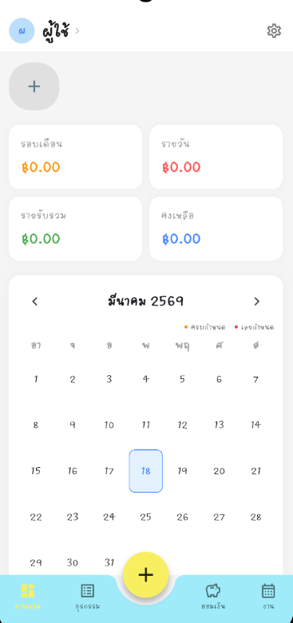
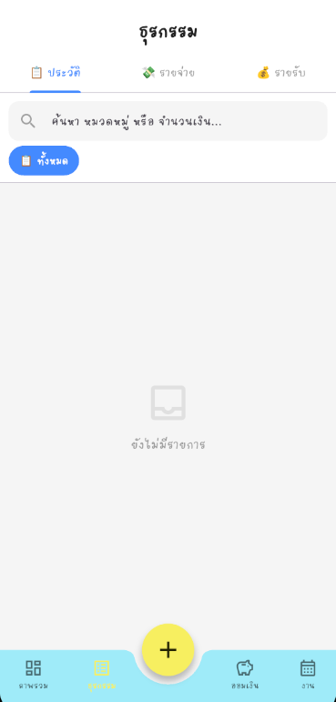
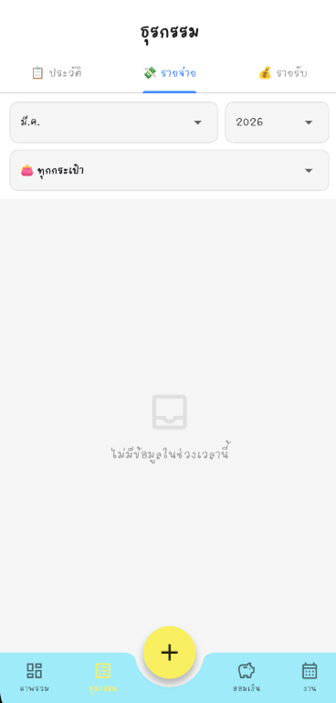
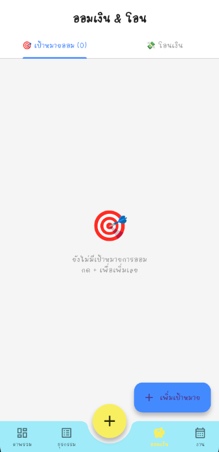

# 💰 LMA App — Ledger Management Application

> **Personal Finance Manager** built with Flutter & Supabase  
> แอปพลิเคชันบันทึกรายรับ-รายจ่ายส่วนบุคคล พัฒนาด้วย Flutter & Supabase

---

## 📱 Screenshots

| ภาพรวม | ธุรกรรม | สรุปกราฟ | ออมเงิน |
|--------|---------|---------|---------|
|  |  |  |  |

---

## 🇬🇧 English

### About
LMA App (Ledger Management Application) is a cross-platform personal finance management app built with Flutter. It helps users track income and expenses, manage multiple wallets, set savings goals, and sync data securely to the cloud via Supabase.

### ✨ Features

| Feature | Description |
|---------|-------------|
| 🏦 **Multi-Wallet** | Create and manage multiple wallets with emoji icons, monthly budget alerts |
| 💸 **Transactions** | Record income/expense quickly, attach slip photos, search & filter |
| 📊 **Analytics** | Pie chart & bar chart breakdowns by category, monthly/yearly view |
| 🎯 **Savings Goals** | Set goals with target amount, track progress, calculate monthly required savings |
| 🔄 **Recurring** | Auto-deduct/add income & expense on daily/weekly/monthly schedule |
| 📋 **Task Manager** | Task list with custom deadline time & notification scheduling |
| 📅 **Calendar** | Tap any date to view transactions and tasks for that day |
| 🔍 **OCR Slip Scan** | Scan bank transfer slip to auto-fill amount using Google ML Kit |
| ☁️ **Cloud Sync** | Local-first architecture with Supabase backup — works offline |
| 🔐 **Multi-Account** | Each account's data is fully isolated, safe to switch accounts |
| 🏷️ **Custom Categories** | Add, edit, reorder your own spending/income categories with emoji |

### 🛠️ Tech Stack

```
Frontend   : Flutter 3.x (Dart)
State      : Provider Pattern
Local DB   : SQLite (sqflite) — v7 with userId isolation
Cloud      : Supabase (PostgreSQL + Auth + Row Level Security)
Charts     : fl_chart
OCR        : google_mlkit_text_recognition
Notify     : flutter_local_notifications + timezone
```

### 📦 Dependencies

```yaml
dependencies:
  flutter_local_notifications: ^17.0.0
  supabase_flutter: ^2.5.0
  sqflite: ^2.3.0
  provider: ^6.1.2
  fl_chart: ^0.68.0
  image_picker: ^1.1.2
  shared_preferences: ^2.3.0
  path_provider: ^2.1.3
  google_mlkit_text_recognition: ^0.13.0
  timezone: ^0.9.4
```

### 🚀 Getting Started

#### Prerequisites
- Flutter SDK 3.x
- Android Studio / Xcode
- Supabase account (free tier works fine)

#### Installation

```bash
# 1. Clone the repository
git clone https://github.com/ChillChill007x/lma-app.git
cd lma-app

# 2. Install dependencies
flutter pub get

# 3. Configure Supabase
# Open lib/config/supabase_config.dart and fill in your credentials:
# url: 'https://YOUR_PROJECT_ID.supabase.co'
# anonKey: 'YOUR_ANON_KEY'

# 4. Run the SQL schema in Supabase SQL Editor
# File: supabase_schema.sql

# 5. Run the app
flutter run
```

#### Android Permissions (AndroidManifest.xml)
```xml
<uses-permission android:name="android.permission.INTERNET"/>
<uses-permission android:name="android.permission.CAMERA"/>
<uses-permission android:name="android.permission.READ_MEDIA_IMAGES"/>
<uses-permission android:name="android.permission.POST_NOTIFICATIONS"/>
<uses-permission android:name="android.permission.SCHEDULE_EXACT_ALARM"/>
<uses-permission android:name="android.permission.RECEIVE_BOOT_COMPLETED"/>
```

### 🏗️ Architecture

```
lib/
├── config/
│   └── supabase_config.dart       # Supabase credentials
├── database/
│   └── db_helper.dart             # SQLite v7 (userId isolated)
├── models/                        # Data models
│   ├── wallet_model.dart
│   ├── transaction_model.dart
│   ├── task_model.dart
│   ├── savings_goal_model.dart
│   ├── recurring_rule_model.dart
│   ├── category_model.dart
│   └── user_profile_model.dart
├── providers/                     # State management
│   ├── auth_provider.dart
│   ├── finance_provider.dart
│   └── user_provider.dart
├── screens/
│   ├── overview_screen.dart
│   ├── transaction_screen.dart
│   ├── savings_screen.dart
│   ├── work_screen.dart
│   ├── settings_screen.dart
│   ├── login_screen.dart
│   └── splash_screen.dart
├── services/
│   ├── sync_service.dart          # Cloud sync (Local-first)
│   └── notification_service.dart
└── widgets/
    ├── quick_menu_popup.dart      # + button with OCR scan
    ├── add_wallet_popup.dart
    ├── wallet_detail_popup.dart
    └── custom_calendar.dart
```

### 🔒 Data Sync Strategy

```
Local-first Architecture:
  1. Every write → SQLite (works offline)
  2. On app open → push to Supabase (background)
  3. On login → clear local → pull from Supabase
  4. Each account data isolated by userId column
```

---

## 🇹🇭 ภาษาไทย

### เกี่ยวกับโปรเจค
LMA App (Ledger Management Application) คือแอปพลิเคชันจัดการการเงินส่วนบุคคลแบบ Cross-platform พัฒนาด้วย Flutter ช่วยให้ผู้ใช้ติดตามรายรับ-รายจ่าย จัดการกระเป๋าเงินหลายบัญชี ตั้งเป้าหมายการออม และสำรองข้อมูลบนคลาวด์ผ่าน Supabase อย่างปลอดภัย

### ✨ ฟีเจอร์หลัก

| ฟีเจอร์ | คำอธิบาย |
|---------|----------|
| 🏦 **หลายกระเป๋า** | สร้างและจัดการกระเป๋าเงินได้ไม่จำกัด พร้อม Emoji ไอคอนและการแจ้งเตือนงบประมาณ |
| 💸 **ธุรกรรม** | บันทึกรายรับ-รายจ่ายด่วน แนบรูปสลิปได้ ค้นหาและกรองรายการ |
| 📊 **กราฟสถิติ** | Pie Chart และ Bar Chart แยกตามหมวดหมู่ ดูรายเดือนหรือรายปีได้ |
| 🎯 **เป้าหมายออมเงิน** | ตั้งเป้าหมาย ติดตาม Progress คำนวณยอดที่ต้องออมต่อเดือน |
| 🔄 **รายการประจำ** | ตัดรายจ่าย/รายรับอัตโนมัติตามความถี่ที่กำหนด |
| 📋 **ตารางงาน** | จัดการงานพร้อมกำหนดเวลาแจ้งเตือนได้อย่างละเอียด |
| 📅 **ปฏิทิน** | กดดูรายละเอียดธุรกรรมและงานของแต่ละวัน |
| 🔍 **สแกนสลิป OCR** | ถ่ายหรือเลือกรูปสลิปเงินโอน ระบบดึงจำนวนเงินอัตโนมัติ |
| ☁️ **Cloud Sync** | สำรองข้อมูลขึ้น Supabase อัตโนมัติ ใช้งานออฟไลน์ได้ |
| 🔐 **หลาย Account** | ข้อมูลแต่ละบัญชีแยกจากกันอย่างสมบูรณ์ |
| 🏷️ **หมวดหมู่กำหนดเอง** | เพิ่ม แก้ไข เรียงลำดับหมวดหมู่พร้อม Emoji ได้เอง |

### 🛠️ เทคโนโลยีที่ใช้

```
Frontend   : Flutter 3.x (Dart)
State      : Provider Pattern
ฐานข้อมูล  : SQLite (sqflite) v7 — แยกข้อมูลตาม userId
Cloud      : Supabase (PostgreSQL + Auth + Row Level Security)
กราฟ       : fl_chart
OCR        : google_mlkit_text_recognition
แจ้งเตือน  : flutter_local_notifications + timezone
```

### 🚀 วิธีติดตั้งและใช้งาน

```bash
# 1. Clone โปรเจค
git clone https://github.com/yourusername/lma-app.git
cd lma-app

# 2. ติดตั้ง dependencies
flutter pub get

# 3. ตั้งค่า Supabase
# เปิดไฟล์ lib/config/supabase_config.dart แล้วใส่ค่า:
# url: 'https://YOUR_PROJECT_ID.supabase.co'
# anonKey: 'YOUR_ANON_KEY'

# 4. รัน SQL Schema ใน Supabase SQL Editor
# ไฟล์: supabase_schema.sql

# 5. รันแอป
flutter run
```

### 🗄️ โครงสร้างฐานข้อมูล

| ตาราง | คำอธิบาย |
|-------|----------|
| `wallets` | กระเป๋าเงิน ชื่อ ยอดเริ่มต้น งบประมาณ |
| `transactions` | รายการรับ-จ่าย เชื่อมกับ wallet |
| `tasks` | งานและ Deadline พร้อมสถานะ |
| `savings_goals` | เป้าหมายการออมเงิน |
| `recurring_rules` | กฎรายการประจำ ความถี่ และประเภท |
| `categories` | หมวดหมู่กำหนดเอง |

> ทุกตารางมี `userId` column เพื่อแยกข้อมูลของแต่ละบัญชีอย่างสมบูรณ์

---

## 📄 License

```
MIT License — feel free to use, modify, and distribute.
```

---

## 🙏 Acknowledgements

- [Flutter](https://flutter.dev) — Cross-platform UI framework
- [Supabase](https://supabase.com) — Open source Firebase alternative  
- [fl_chart](https://pub.dev/packages/fl_chart) — Beautiful charts for Flutter
- [Google ML Kit](https://developers.google.com/ml-kit) — On-device OCR

---

<div align="center">
  <sub>Built with ❤️ using Flutter & Supabase</sub>
</div>
